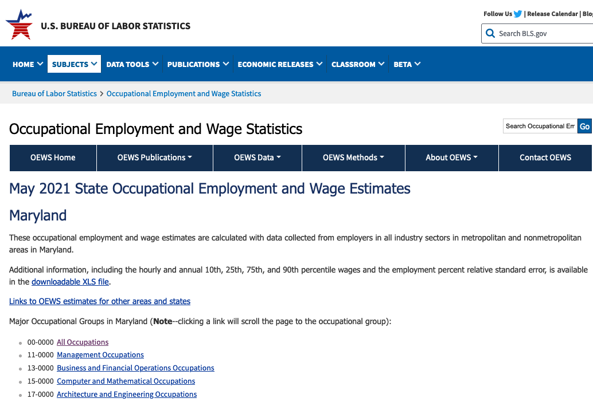
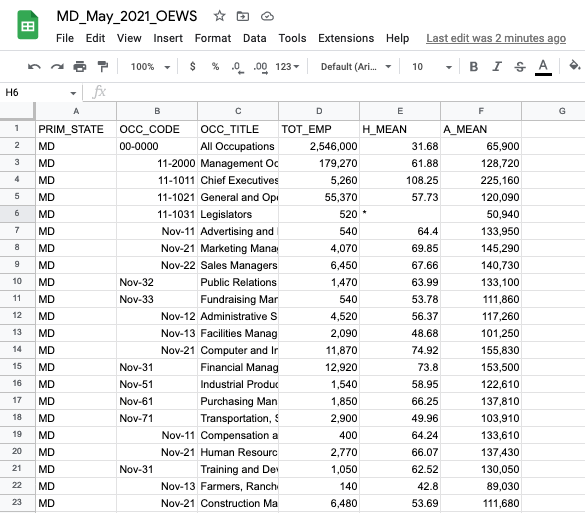
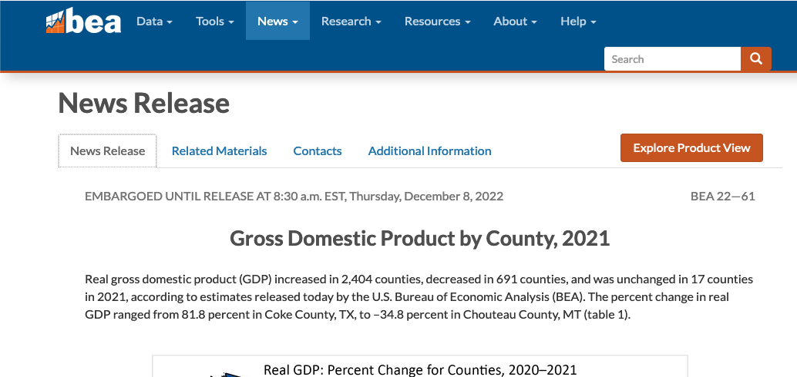

#### The Philip Merrill College of Journalism 
#### The Wall Street Journal
**Feb. 24, 2023**.  
    

**Link to Today's Presentation**. 

> **<https://tinyurl.com/merrillwsj>**

<!--- >>> --->

> **Presenter**
 
Rob Wells, Ph.D., Philip Merrill College of Journalism

 

> **Learning Outcome:**. 
 
You will learn to how to retrieve and analyze employment and regional GDP data for their own counties or states and the steps to put it on a basic interactive charts. We will use Google Sheets and Datarapper. We will make a basic interactive map.

<!--- >>> --->  

 
---

# Storytelling with Employment Data

In this exercise, we will find out how much the typical engineer makes versus the typical journalist.

> [Check out the Maryland Occupational Employment and Wage Statistics GDP press release: "CNTL" + click for a New Tab](https://www.bls.gov/oes/current/oes_md.htm){target="_blank"}

<!--- >>> --->  

 

> Scroll down to the table, **use the search box and type in "waiter."** You'll see mean hourly wage for waiters in Maryland is ... ???

   

 

<!--- >>> --->  

 
**Questions**:  

    What is the median hourly wage for Chief Executives?
    What is the annual mean wage for Gambling Dealers?
   

Let's work with the data ourselves. I've created a simplified version for this lesson that just focuses on Maryland

> [Download the Maryland Occupational Employment and Wage Statistics](https://docs.google.com/spreadsheets/d/1iA43WV1AOrOo8tUAKG2fZ45jdFO29tQL-WyHqUvgVS8/edit?usp=sharing){target="_blank"}

Open the file in Google Sheets.
It will look like this:

<!--- >>> --->  
  

What do these columns mean? Look for the data dictionary or field descriptions. To save time, I downloaded in separately and put it here.

[Look at field descriptions for Maryland Occupational Employment and Wage Statistics](https://docs.google.com/spreadsheets/d/1pUo9reCv6OvN87EZvFeHYJVN9qM57GeR/edit?usp=sharing&ouid=102324743793755798467&rtpof=true&sd=true){target="_blank"}

> Analyze [the Maryland Occupational Employment and Wage Statistics.](https://docs.google.com/spreadsheets/d/1iA43WV1AOrOo8tUAKG2fZ45jdFO29tQL-WyHqUvgVS8/edit?usp=sharing){target="_blank"}

    1) Sort the sheet to find the highest and lowest hourly wage. Take a look at the list. What surprised you?
    
    2) The "All Occupations" entry summarizes the Maryland workforce. Find the average annual salary for all occupations. 
    Count how many occupations are below that average and how many above? 
    How could that be a story?
    
    3) Filter for journalists. 
    --Apply Filter to OCC_Code. 
    --Select Filter by Condition. 
    --Select Text contains. 
    --Type in "journalists" and apply
    How does that annual salary compare to the state average?
    How could that be a story?
    
    4) Examine the OCC_CODE column. The occupations ending in "0000" are occupational categories. Filter OCC_CODE for "0000" and examine the 23  occupational categories.
    --Apply Filter to OCC_Code. 
    --Select Filter by Condition. 
    --Select Text contains. 
    --Type in -0000 and apply
    You now will have a list of the 23 occupational categories
    
    
    5) Copy and paste the results on to a new sheet.
    --Select the results and copy
    --Click + icon at bottom left. A new blank sheet is created. Name it Occupations
    --Click at cell A1 and paste your results 
    
    How could this be a story?
    
<!--- >>> --->

  

# Step 2: Basic Interactive Chart

    

**Datawrapper Account**

Datawrapper creates great charts and maps in the cloud, which you can use to embed in your stories. There's no software to install on your computer.

I recommend you [create a Datawrapper account](https://app.datawrapper.de/signin?ref=/#/signin){target="_blank"}

Or try Datawrapper [without an account](https://app.datawrapper.de/create/chart){target="_blank"}

<!--- >>> --->

#### Create Chart On Datawrapper:

    1--Select "Create new" and select chart.
    2--Select "Connect Google Sheet" and paste URL from our Occupations sheet. Select "Proceed"
    3--Check and Describe, make sure all was imported correctly
    4--Visualize
        a--Select Bar Chart
        b--Select Refine Tab
            * Bars = A_Mean
            * Labels = OCC_TITLE
            * Show Values: Number format: Custom and paste in this into the box: $0.00]a
            * Sorting and Grouping: Select Reverse Order
            
        c--Select Annotate Tab: 
            * Type in a headline, description, Data Source, link to original data and your byline. Click for social media sharing
     
     5--Click publish & Embed
    
<!--https://datawrapper.dwcdn.net/yU4Iu/1/--> 
    
<!--- >>> --->

 

<iframe title="Average Salaries for Maryland Occupations" aria-label="Bar Chart" id="datawrapper-chart-yU4Iu" src="https://datawrapper.dwcdn.net/yU4Iu/1/" scrolling="no" frameborder="0" style="width: 0; min-width: 100% !important; border: none;" height="778" data-external="1"></iframe>

<!--- >>> ---> 

# Step 3: Storytelling with Local GDP Data  

<!--- >>> ---> 

GDP tells us if the economy is great or if it sucks.

It's the **Big Daddy of economic indicators**.

What is Gross Domestic Product? It measures the value of all final goods and services produced in the country in a year. 

For example: that would be all of the stuff sold by Walmart and all of the beer sold by Liquor Barn and all of the gas pumped at Citgo, etc., AND A WHOLE LOT MORE, over a year.

You get the idea.

You can break it down to a state or a region, and also break it down into three month periods.

As a reporter, you can use local GDP data to figure out what business sectors are doing well and which ones stink. It can lead you to excellent stories.

This section will analyze the storytelling possibilities with the Gross Domestic Product by County data. 

[Check out the local GDP press release](https://www.bea.gov/newsreleases/regional/gdp_metro/gdp_metro_newsrelease.htm){target="_blank"}

> What's in the GDP data   

"Gross domestic product (GDP) by metropolitan area is the sub-state counterpart of the Nation's gross domestic product (GDP), the Bureau's featured and most comprehensive measure of U.S. economic activity. GDP by metropolitan area is derived as the sum of the GDP originating in all the industries in the metropolitan area.  

Contributions to growth are an industry's contribution to the state's overall percent change in real GDP. The contributions are additive and can be summed to the state's overall percent change. The statistics of GDP by metropolitan area released today are consistent with statistics of GDP by state.

GDP at chained volume measure is adjusted for the effect of inflation to give a measure of ‘real GDP’."

**Data limitations**  

This data series lags significantly. We are working with 2021 data, the most recent available. But it is still the best you can get and you can't beat the price.  
 
<!--- >>> --->  

### Retrieve GDP Data 
 
  

<!--- >>> --->
  

> [Click here to download the Excel tables](https://www.bea.gov/sites/default/files/2022-12/lagdp1222.xlsx){target="_blank"}

You should have a **file named "lagdp1222.xlsx"** downloaded. Open it up.

 

> Let's see what we have.   
    * One table of data.   
    * 3,223 rows with county data.    
    * GDP for four years, percentage change, and state ranking.

<!--- >>> ---> 
For this exercise, I cut down the table to Maryland-only data. 

> [Maryland 2021 GDP](https://docs.google.com/spreadsheets/d/1UzdiXfGXGGcY3lokwxrLIs7HapXfz-2Uj0lBPTGA2z4/edit?usp=sharing){target="_blank"}

#### Walk through the GDP table:

Inflation adjusted GDP, chained to 2012.
Dollar amounts in thousands

This is cool because it has the percentage change growth, 2019/2021, and ranks it. 

> Let's interrogate this table a bit.   

    1--Sort counties according to total GDP in 2021
    2--Sort counties according to 2021_pct_rank_state 
    
    Were you surprised to see the top county by GDP?
    How are the lists different? 
    What are some potential stories?
    
    3--Next, look for the losers. Which counties saw declines in 2021 GDP? 

<!--- >>> --->  

> **Question: What is the basic number for comparison with percentage GDP growth in 2021? In other words, what is the benchmark metric? **

<!--Answer: US 5.9% growth. Maryland, 4.6% growth Is your region above or below that benchmark?--> 

    

**Data Cleaning** 

The Google sheet you have has been cleaned and modified so it will play well with Datawrapper. Basically, the BEA spreadsheet was cleaned to remove merged cells and new headers were created. 

Here is a [10-minute video](https://www.youtube.com/embed/5bS-GKvFzBk){target="_blank"} on basic data cleaning, using an older version of the data, which you can watch later.

<!--- >>> --->

### Build a GDP chart

> [Go to Datawrapper](https://app.datawrapper.de/signin?){target="_blank"}

    1--Select "Create new" and select chart.
    2--Select "Connect Google Sheet" and paste URL from our Maryland 2021 GDP sheet: 
    https://docs.google.com/spreadsheets/d/1UzdiXfGXGGcY3lokwxrLIs7HapXfz-2Uj0lBPTGA2z4/edit?usp=sharing
      a--Select "Proceed"
    3--Check and Describe, make sure all was imported correctly
      a--Select Maryland and United States rows and delete
      b--Select all columns EXCEPT 2021_GDP and "Hide column from visualization" then click "Proceed"
    4--Visualize
        a--Select Area Chart
        b--Select Refine Tab
            * Bars = A_Mean
            * Labels = OCC_TITLE
            * Show Values: Number format: Custom and paste in this into the box: $(0,0.000)
            * Sorting and Grouping: Select Reverse Order
            
        c--Select Annotate Tab
            * Type in a headline, description, Data Source, link to original data and your byline. 
            * Add text annotation to label Montgomery County's peak.
            
        d--Layout Tab: Click for social media sharing
     
     5--Click publish & Embed

<!--https://datawrapper.dwcdn.net/p6oP9/1/--> 

<iframe title="Montgomery County Dominates Maryland's Economy" aria-label="Interactive area chart" id="datawrapper-chart-p6oP9" src="https://datawrapper.dwcdn.net/p6oP9/3/" scrolling="no" frameborder="0" style="border: none;" width="600" height="719" data-external="1"></iframe>

<!--- >>> --->

 

### GDP chart: State, National Context

This follows similar steps as above but the visualization is on the 2021 percentage change, which allows comparisons to the state and national levels.

    1--Select "Create new" and select chart.
    2--Select "Connect Google Sheet" and paste URL from our Maryland 2021 GDP sheet: 
    https://docs.google.com/spreadsheets/d/1UzdiXfGXGGcY3lokwxrLIs7HapXfz-2Uj0lBPTGA2z4/edit?usp=sharing
      a--Select "Proceed"
    3--Check and Describe, make sure all was imported correctly
      a--Select all columns EXCEPT 2021_pct_chg and "Hide column from visualization" then "Proceed"
    4--Visualize
      a--Select Bar Chart
      b--Select Refine Tab
              * Show Values
              * Number format: Custom and paste in this into the box: 0.0%
              * Appearance: Customize colors. Turn United States red; Maryland, orange
              * Sorting and Grouping: Sort bars
          
       c--Select Annotate Tab
              * Type in a headline, description, Data Source, link to original data and your byline. 
              * Add text annotation to label Montgomery County's peak.
       d--Layout Tab: Click for social media sharing

     5--Click publish & Embed
     
<!--https://datawrapper.dwcdn.net/vwtwJ/1/--> 
    

<iframe title="Eastern Shore Counties Exceed U.S. Growth Rate" aria-label="Bar Chart" id="datawrapper-chart-vwtwJ" src="https://datawrapper.dwcdn.net/vwtwJ/1/" scrolling="no" frameborder="0" style="width: 0; min-width: 100% !important; border: none;" height="718" data-external="1"></iframe>

> You now have a GDP growth chart for the counties in Maryland with statewide and U.S. comparison figures. 

<!--- >>> --->

 

# Step 4: Basic Map

 .   

> **We'll use Datawraper again to build a chloropleth map of the total GDP per county in Maryland.** 

    1--Select "Create new" and select Map and then "Chloropleth map."
    2--Type "Maryland" in the search box and select "USA>>Maryland>>Counties" and then "Proceed"
    3--Add your data, select Connect Google Sheet at the bottom. Use this version, which omits the U.S. and Maryland totals:
    https://docs.google.com/spreadsheets/d/149YeVPvnyUAFW2KUv9vCapTcLrtFLYloCj79A4on6y0/edit#gid=1143515708
       a--Values, select 2021_GDP then "Proceed"
    4--Visualize, select "Annotate" tab
        a--Tooltips, find county_name and select for the title box. The value should be 2021_gdp
        b--Select Show labels, place names appear on map
        c--Type in a headline, description, Data Source, link to original data and your byline. 
        Select "Refine" tab
        a--Legend - Format - custom: $(0,0.00)
        
        And Proceed to Publish

<!--https://datawrapper.dwcdn.net/UY7hG/1/--> 

    

> **Your finished map should look like this:**  

 
 
<iframe title="Montgomery County Powers Maryland's Economy" aria-label="Map" id="datawrapper-chart-UY7hG" src="https://datawrapper.dwcdn.net/UY7hG/2/" scrolling="no" frameborder="0" style="width: 0; min-width: 100% !important; border: none;" height="457" data-external="1"></iframe>

<!--- >>> --->

 

# Nerd Corner - Advanced Users. 

* If you are good with this tutorial, then you can go back to the BEA website, look at the Regional Economic Accounts page and grab data for [income trends per county since 1969](https://apps.bea.gov/regional/downloadzip.cfm){target="_blank"}.   

* Or you can look for data on [industry-specific sector growth](https://apps.bea.gov/regional/downloadzip.cfm){target="_blank"}    

  Select Personal Income (State and Local) and then "CAEMP25N: Total Full-Time and Part-Time Employment by NAICS Industry." This is a huge dataset and you can track county level employment in any of these sectors:
    + Arts, entertainment, recreation, accommodation, and food services   
    + Construction  
    + Durable-goods manufacturing   
    + Educational services, health care, and social assistance   
    + Finance, insurance, real estate, rental, and leasing   
    + Government   
    + Information	 
    + Professional and business services 
    + Trade   
    + Transportation and utilities   
<!--- >>> ---> 

> Detailed Instructions to Obtain More In-Depth GDP Data

     

> **With the regional data. heres's one option to profile a county's economy:**   

<!--- >>> --->  

<iframe title="Montgomery County's Employment Picture Over Two Decades" aria-label="Split Bars" id="datawrapper-chart-Y4E92" src="https://datawrapper.dwcdn.net/Y4E92/1/" scrolling="no" frameborder="0" style="border: none;" width="600" height="991" data-external="1"></iframe>

 

>  **Duplicate and Iterate.**    
  The great thing about this data work is you can iterate and improve on your work. My tip: save the version you like, then copy it and refine it again. 
> Now, go experiment and figure out some other visualization!

<!--- >>> --->   

 
<!--- >>> --->

>  **More Resources.**    
  I recorded a series of lectures for the Sage Research Methods video series on data visualization and research. You can find them here:   
  
[**“Practical Tips for Doing Online Archival Research.”**](https://dx.doi.org/10.4135/9781529604528){target="_blank"}.  
      
[**“Storytelling With Big Data: An Example From COVID-19 Data.”**](https://dx.doi.org/10.4135/9781529602760){target="_blank"}.  
      
[**“Choosing the right visualization tools for COVID-19 data.”**](https://www.doi.org/10.4135/9781529778342){target="_blank"}. 
      
<!--- >>> --->
     

### Follow up questions:   

- Rob Wells - robwells@umd  

**Based on an earlier presentation with these co-authors**   

- Jeannine Aversa, Bureau of Economic Analysis, Jeannine.Aversa@bea.gov    

- Thomas Dail, Bureau of Economic Analysis, Thomas.Dail@bea.gov  

   
<!--- >>> --->

**Thank you.**  
   

**--30--**

